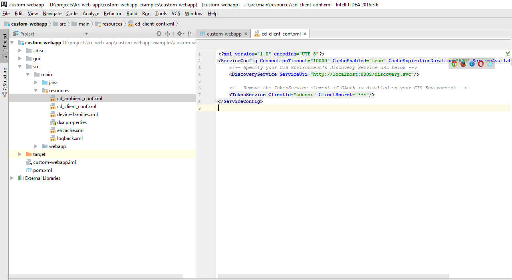
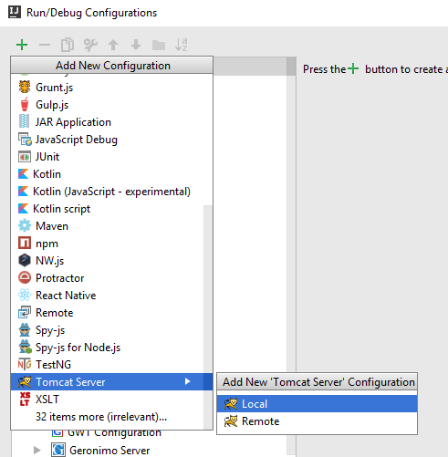
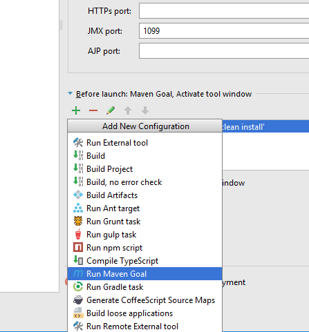
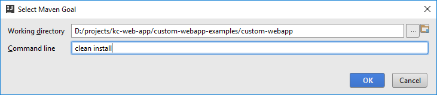
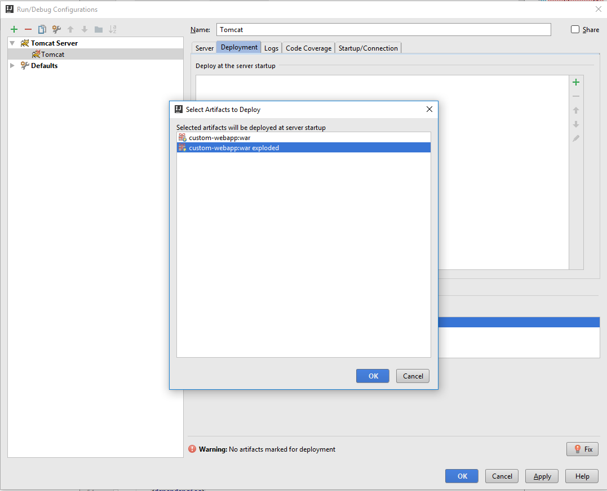
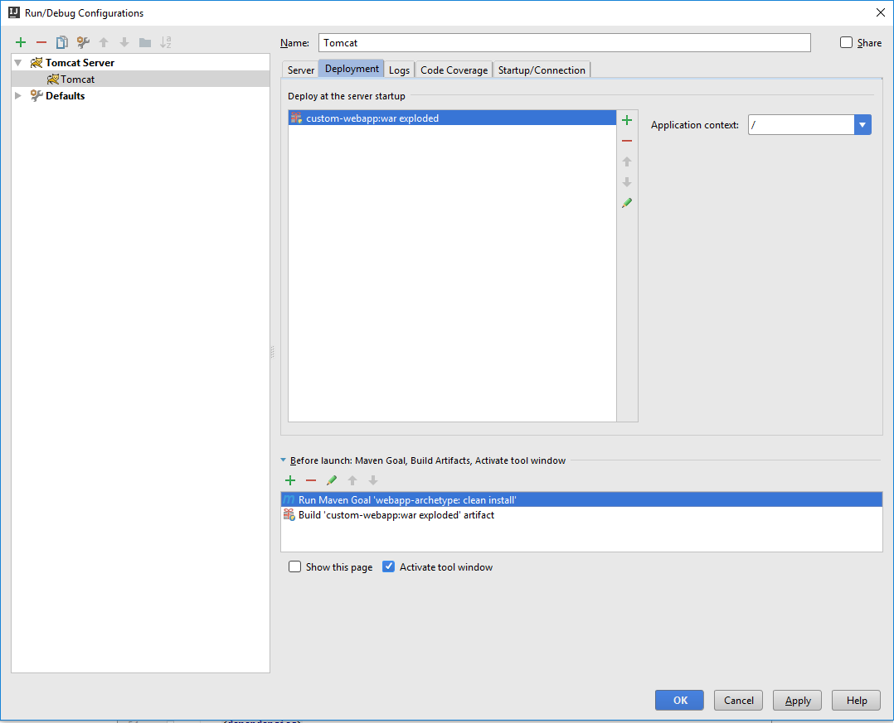

# Getting Started

Welcome to the new Content Delivery Web Application! This tutorial will take you through creating a custom application. 
We assume you are familiar with **TypeScript, JavaScript (ES6), Webpack, HTML, XML, React, LESS, CSS, Java, Spring, DXA and Maven**.

Some learning material:

1. [JavaScript (ES6)](https://egghead.io/courses/learn-es6-ecmascript-2015)
2. [TypeScript Getting Started](https://egghead.io/courses/up-and-running-with-typescript)
3. [TypeScript Tutorial](https://www.typescriptlang.org/docs/tutorial.html )
4. [React Fundamentals](https://egghead.io/courses/react-fundamentals)
5. [React Hello World](https://facebook.github.io/react/docs/hello-world.html)
6. [LESS](http://lesscss.org/)
7. [Webpack](https://webpack.js.org/)
8. [Webpack Course](https://egghead.io/courses/using-webpack-for-production-javascript-applications)
9. [Serving Web Content with Spring MVC](https://spring.io/guides/gs/serving-web-content/)
10. [Maven Getting Started Guide](https://maven.apache.org/guides/getting-started/)
11. [Getting started with DXA 1.7](http://docs.sdl.com/LiveContent/content/en-US/SDL%20DXA-v7/GUID-D36601FA-88DD-48A6-A8C0-61159673C2F4)
12. [Developing on DXA Java](http://docs.sdl.com/LiveContent/content/en-US/SDL%20DXA-v7/GUID-BEDE64AE-1E23-4784-AE5E-7DA84B26F1AA)

## Software requirements

Make sure you have installed:

* [Node.js](https://nodejs.org/) 
  * 64 bit version is recommended
  * Install NodeJs v6.x or higher
* [Maven 3](https://maven.apache.org/download.cgi)
* [Tomcat 8.5](http://tomcat.apache.org/download-80.cgi)
* An IDE which has support for TypeScript / LESS
  * [Atom](https://atom.io/)
  * [Sublime Text](https://www.sublimetext.com/)
  * [Visual Studio Code](https://code.visualstudio.com/)
  * ...
* An IDE which has support for Java
  * [IntelliJ IDEA](https://www.jetbrains.com/idea/specials/idea/idea.html)
  * ...
* A Content Delivery environment with data

In the following guide I'm using IntelliJ IDEA Ultimate (for Java) and Visual Studio Code (for LESS / TypeScript / JavaScript).

## Setting up Maven

In order to download some snaphot artifacts which are used by the archetype. We will need to add a reference to the sonatype snaphots repository.

1. Open up your main `settings.xml` file. On an Windows machine this file is located at `C:\Users\<username>\.m2\settings.xml`, on a Linux Ubuntu it is at `/usr/share/maven/conf/settings.xml`.
2. Add an extra profile inside the `profiles` section (see code snippet below)
3. Make this the active profile (see code snippet below)

```xml
<settings>
    <profiles>
        <profile>
            <id>sonatype-nexus-snapshots</id>
            <repositories>
                <repository>
                    <id>sonatype-nexus-snapshots</id>
                    <name>sonatype-nexus-snapshots</name>
                    <url>https://oss.sonatype.org/content/repositories/snapshots</url>
                    <releases>
                        <enabled>false</enabled>
                    </releases>
                    <snapshots>
                        <enabled>true</enabled>
                    </snapshots>
                </repository>
            </repositories>
        </profile>
    </profiles>
    <activeProfiles>
        <activeProfile>sonatype-nexus-snapshots</activeProfile>
    </activeProfiles>
</settings>
```

## Create a new project using the Maven Archetype

First step we will need to do is to create a directory. 
I've create following directory on my machine: `D:\projects\kc-web-app\custom-webapp-examples`. 
I'll be usign this directory further on inside my examples.

Ok Let's start by opening the command prompt and run:

```bash
cd "D:\projects\kc-web-app\custom-webapp-examples"
mvn archetype:generate "-DarchetypeArtifactId=dd-webapp-archetype" "-DarchetypeGroupId=com.sdl.delivery.ish" "-DarchetypeVersion=0.1.2"
```

Notice that I'm using version `0.1.2`, this is just an example. Advised is to use the latest available version.
I'll pick `org.company` as my group id and `custom-webapp` as the name of my artifact id.

```bash
[INFO] Scanning for projects...
[INFO]
[INFO] ------------------------------------------------------------------------
[INFO] Building Maven Stub Project (No POM) 1
[INFO] ------------------------------------------------------------------------
[INFO]
[INFO] >>> maven-archetype-plugin:3.0.1:generate (default-cli) > generate-sources @ standalone-pom >>>
[INFO]
[INFO] <<< maven-archetype-plugin:3.0.1:generate (default-cli) < generate-sources @ standalone-pom <<<
[INFO]
[INFO] --- maven-archetype-plugin:3.0.1:generate (default-cli) @ standalone-pom ---
[INFO] Generating project in Interactive mode
[INFO] Archetype repository not defined. Using the one from [com.sdl.delivery.ish:dd-webapp-archetype:0.1.2] found in catalog remote
Define value for property 'groupId': org.company
Define value for property 'artifactId': custom-webapp
Define value for property 'version' 1.0-SNAPSHOT: :
Define value for property 'package' org.company: :
Confirm properties configuration:
groupId: org.company
artifactId: custom-webapp
version: 1.0-SNAPSHOT
package: org.company
 Y: : y
```

## Setting up IntelliJ IDEA development environment

Next step I'll do is setting up IntelliJ IDEA for development.

1. Launch IntelliJ
2. Open the directory where you've created the archetype, in my case this is the `D:\projects\kc-web-app\custom-webapp-examples\custom-webapp` directory


### Setting up Content Delivery configuration

First step is to add the necessary configuration inside the `cd_client_config.xml` file. We'll need to provide the location of the discovery service, the client id and client secret of the Content Delivery system we are using.
This file can be found at `src/main/resources/cd_client_conf.xml`.



### Setting up Tomcat

In order to debug it I'll setup a configuration for Tomcat.

1. Click on the `Run` item in the top menu
2. Open `Edit Configurations`
3. Click on the `+` icon on the top left
4. Go to `Tomcat Server` and click on `Local`



5. Define a name for the configuration, I'm using `Tomcat`
6. Remove all task from the list at the bottom of the dialog
7. Add a new Maven goal



8. Fill in `clean install` inside the command line field



9. Click Ok

10. Open the `deployment` tab
11. Click on the `+` icon next to the `Deploy at server startup` list



12. Select the exploded war file
13. Close the dialog by clicking the Ok button



14. Start the custom web application by clicking on `Run` -> `Debug 'Tomcat'`

## Start customizing

### Change the skin using the Theming capabilities

### Advanced skin changes using css

### Creating a custom home page

### Extend json api exposed by DXA Ish Module

## Deploying your custom web application

