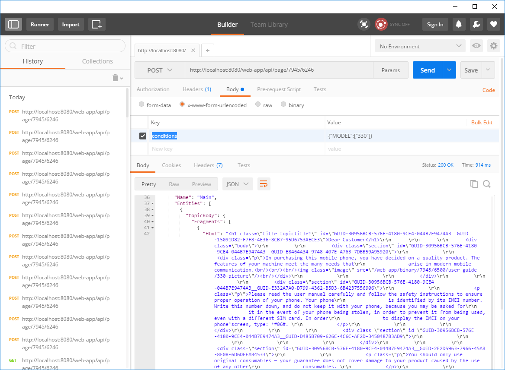

# Filtering content using conditions

When publishing your content from the CM to the UPD plaform the conditions are preserved. 
These conditions can be dynamically filtered on the fly.
In this document I'll describe how you can use the api exposed by the DXA Ish Module to do this.

## How to find the id of a page?

**Replace `http://localhost:8080/web-app/` with the path to your own installation.**

The api to retrieve the content of a page is `http://localhost:8080/web-app/api/page/<publicationId>/<pageId>`.

You can get to the publication id using the `http://localhost:8080/web-app/api/publications` api which will give you back all publications in the system.
To get to the page you need to use the toc api to navigate through the structure of the publication. To get the root items use `http://localhost:8080/web-app/api/toc/<publicationId>/t1`.
Retrieving children of a toc item can be done by using following api `http://localhost:8080/web-app/api/toc/<publicationId>/<keywordId>` (eg `http://localhost:8080/web-app/api/toc/7945/t1-k21`).

It's also possible to just open the application in the browser and go to the page using the user interface.
The url in the address bar contains both the publication and page id. eg `http://localhost:8080/web-app/7945/6246/user-guide/dear-customer` becomes `http://localhost:8080/web-app/api/page/7945/6246`.

## Filtering page content

To filter the page content you need to do a post request. I'm going to use [Postman](https://www.getpostman.com/) as my http client.

The data I'm using can be totally different, so don't blindly copy the values as they will not work for you.

1. I'm going to retrieve the html for a topic using following api `http://localhost:8080/web-app/api/page/7945/6246`
2. In the response you'll see a metadata field with the key `conditionsused.generated.value`, this value indicates which conditions are being used inside the topic. For me the value is `"{\"MODEL\":[\"660\",\"330\"],\"BLUETOOTH\":[\"Y\"]}"`. `Model` and `Bluetooth` are the names of conditions, next to it is the value.
3. I'll filter the page to only show the data for the `Model` with a value of `330`. I can do this by adding in the form body using the `x-www-form-urlencoded` option a key with the name `conditions` and the value `{"MODEL":["330"]}`.

**It's only required to specifiy the values of the condition you wish to overwrite.** 
I did not have to provide data for the `Bluetooth` condition. Behind the scenes the server will merge the conditions in the form body with the default conditions set. 
In my example `{"MODEL":["330"]}` becomes `{"MODEL":["330"], "BLUETOOTH":["Y"]}` on the server and this would be used for filtering the topic content.